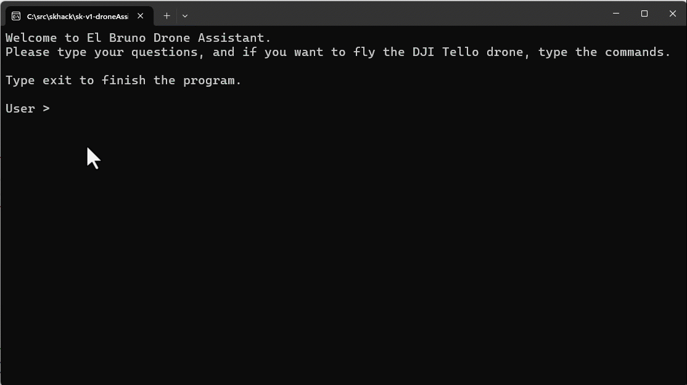
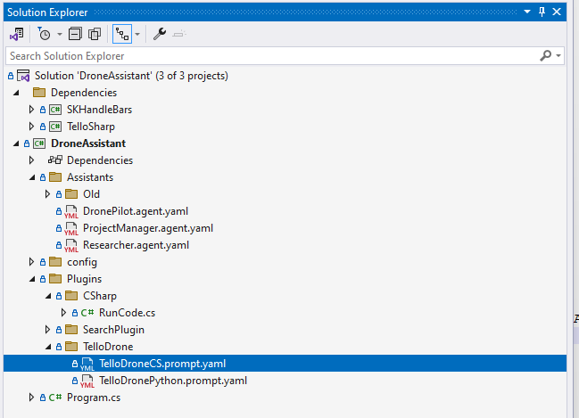
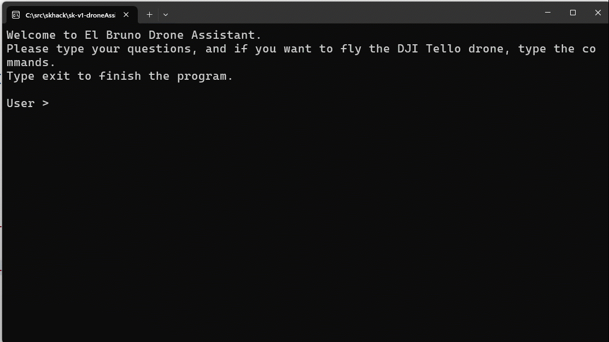
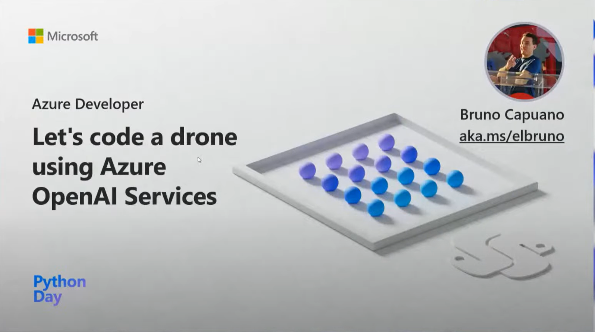
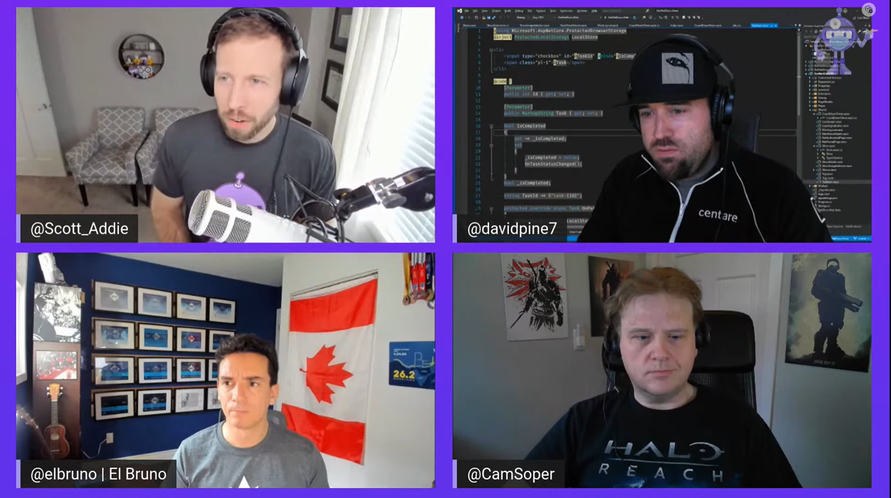

# Semantic Kernel V1 Assistant for DJI Tello Drone Control 🚀

[](/LICENSE)
[](https://twitter.com/elbruno)


## 🌟 General Description
In this project, my goal was to learn about the new Assistant features in Semantic Kernel V1. The main application of this project draws inspiration from Matthew Bolanos's work, which you can explore [here](https://github.com/matthewbolanos/sk-v1-proposal/tree/main/dotnet/samples/06-Assistants).

Learn more information about the [Semantic Kernel v1.0 Hackathon!
](https://github.com/alexchaomander/semantic-kernel-v1.0-hackathon).

## 💡 The Idea
The concept is to create an assistant capable of controlling a DJI Tello Drone through typed natural language commands. This assistant utilizes two primary skills:
1. **Code Generation**: Understanding of a set of actions in natural language, and generating C# code to fly the drone.
2. **Code Execution**: Running the generated C# code to execute the flight plan.

The assistant can both craft and implement a flight plan in C#. For clarity, an Assistant YAML Sample definition is included in the project. Additionally, here's an animation illustrating the process, where the main Assistant invoke the Drone Pilot Assistant, and uses the plugins to process the requests.



Here is a demo that also includes the drone flying:


***Note:** There are longer live drone fly demos at the bottom of the page.*

## 🛠️ Plugins
The project explores two types of plugins:
1. **Tello Drone Plugin**: A prompt-based plugin using a template to create drone-compatible C# code.

    General content of the template:
    ```javascript
            name: GenerateDroneFlightPlan
            template: |
                <message role="user">{
                Use this C# code as reference

                [CODE START]
                // Section usings
                using TelloSharp;

                // Section connect to drone
                Tello tello = new();
                tello.Connect();

                // Section validate connection
                Console.WriteLine("Start Connection");
                
                // ...

                // land the drone
                tello.Land();
                Console.WriteLine("Land");
                [CODE END]

                Generate C# code only to follow these commands, add the commands in the actions section.
                Add a 5 seconds delay between commands.
                Always include the section usings, connect to drone, validate connection, display battery level, land drone. 

                Commands = {{drone_flight_plan}}
                }</message>
            template_format: handlebars
            description: A function that generates C# code for a drone to fly a mission
            input_variables:
            - name: drone_flight_plan
                type: string
                description: The drone actions to perform 
                is_required: true
            execution_settings:
            - model_id_pattern: ^gpt-4
            - model_id_pattern: ^gpt-3\.?5-turbo
      ```

2. **C# CodeRun Plugin**: This is a C# code-based plugin that employs Roslyn to execute C# code. It uses "Microsoft.CodeAnalysis.CSharp" and "Microsoft.CodeAnalysis.CSharp.Scripting" nuget packages.
    
    Key code for running C# code:
    ```csharp
    var result = "OK";
    var options = ScriptOptions.Default
        .AddReferences(typeof(object).Assembly)
        .AddReferences(typeof(TelloSharp.Tello).Assembly)
        .AddImports("System", "System.IO", "System.Text", "System.Text.RegularExpressions");

    // convert the code to run to a valid string in unicode
    codeToRun = Encoding.UTF8.GetString(Encoding.UTF8.GetBytes(codeToRun));

    // validate that the code to run is not empty
    if (string.IsNullOrEmpty(codeToRun))
    {
        result = "Error: Code to run is empty";
        return result;
    }

    try
    {
        var t = await CSharpScript.RunAsync(codeToRun, options);
    }
    catch (CompilationErrorException ex)
    {
        Console.WriteLine(">> Compilation Error");
        var sb = new StringBuilder();
        foreach (var err in ex.Diagnostics)
            sb.AppendLine(err.ToString());
        result = sb.ToString();
        Console.WriteLine(result);
    }
    catch (Exception ex)
    {
        // Runtime Errors
        result = ex.ToString();
        Console.WriteLine(">> Run time exception");
        Console.WriteLine(result);
    }

    return result;
    ```

Here's the current project structure, including the DronePilot Assistant and the plugins:



## 📝 Sample Generated Code
Examples of inputs and generated C# code:

- Input: **"Send the drone the following actions: takeoff, bounce and land"**

    Generated C# Code:
    ```csharp
    using TelloSharp;

    Tello tello = new();
    tello.Connect();

    Console.WriteLine("Start Connection");
    int i = 0;
    while (tello._connectionState != Tello.ConnectionState.Connected)
    {
        Console.WriteLine("Connecting ... " + i);
        System.Threading.Thread.Sleep(1000);
        i++;        
        if (i == 5)
            break;
    }

    Console.WriteLine("Connected. Battery Level " + tello.State.BatteryPercentage);

    // take off the drone
    tello.TakeOff();
    Console.WriteLine("Take Off");

    // sleep of 5 seconds
    System.Threading.Thread.Sleep(5000);

    // tello drone bounce
    tello.Bounce();
    Console.WriteLine("Bounce");

    // land the drone
    tello.Land();
    Console.WriteLine("Land");
    ```

- Input: **"Search on how can we program and control the DJI Tello drone using C#?"**
    
    Output console:
    

## 📚 Notes
I tested the Assistants and plugins with two GPT models: `gpt-4-1106-preview` and `gpt-3.5-turbo-1106`. Here's a C# snippet for the models:
```csharp
// GPT models
//IChatCompletion gpt = new OpenAIChatCompletion("gpt-4-1106-preview", OpenAIApiKey);
IChatCompletion gpt = new OpenAIChatCompletion("gpt-3.5-turbo-1106", OpenAIApiKey);
```
Both models performed well, with ***`gpt-3.5-turbo-1106` being faster and more economical***.

The Researcher Assistant and Search Plugin remain in the project for demonstration. The Project Manager utilizes these tools to interact with the user:
```csharp
// Project Manager and Drone Pilot Assistant code
// ---------------------------------------------------
// DRONE PILOT Assistant
// ---------------------------------------------------
// Create a drone pilot assistant
IPlugin dronePilot = AssistantKernel.FromConfiguration(
	currentDirectory + "/Assistants/DronePilot.agent.yaml",
	aiServices: new() { gpt },
	plugins: new() { openAIChatCompletionDrone, csharpCodeManagerPlugin }
);
// Create a Project Manager
AssistantKernel projectManager = AssistantKernel.FromConfiguration(
	currentDirectory + "/Assistants/ProjectManager.agent.yaml",
	aiServices: new() { gpt },
	plugins: new() { researcher, dronePilot }
);
```

Also, I prepared a set of demo user inputs for demonstration purposes:
```csharp
// Sample user input for demo
switch (userInput.ToLower())
{
    case "d1":
        userInput = "send the drone the following actions: takeoff the drone, move forward 25 centimeters and land";
        break;
    case "d2":
        userInput = "send the drone the following actions: takeoff, bounce and land";
        break;
    case "d3":
        userInput = "send the drone the following actions: takeoff, flip forward and land";
        break;        
    default:
        break;
}
```

## 🚁 Drone Experience
I have been doing demos with C# and Python using a DJI Tello drone for several years. 

You can find resources about my experience in **[http://aka.ms/elbrunodrones](http://aka.ms/elbrunodrones)**. 

For this project, I used an open-source library: **[TelloSharp](https://github.com/sblanchard/TelloSharp)**, rather than creating a drone SDK from scratch. 

## 📺 Related Videos

If you want to know more about how to create a SDK from scratch:

- A talk during Azure Python Day: **["Let's code a drone using Azure OpenAI Services"](https://www.youtube.com/live/9xxpn-bJes0?si=p36G6hf4fEHNgSGz&t=18120)**

    [](https://www.youtube.com/live/9xxpn-bJes0?si=p36G6hf4fEHNgSGz&t=18120)


- A presentation on The .NET Docs Show: **["Let's code a drone  to follow faces"](https://www.youtube.com/watch?v=2xeKomASV0E&ab_channel=dotnet)**

    [](https://www.youtube.com/live/9xxpn-bJes0?si=p36G6hf4fEHNgSGz&t=18120)

---

Eager to share this project with the hackathon community and looking forward to your feedback and collaboration! Let's explore new horizons together! 🌍🚁

## Author

👤 **Bruno Capuano**

* Website: https://elbruno.com
* Twitter: [@elbruno](https://twitter.com/elbruno)
* Github: [@elbruno](https://github.com/elbruno)
* LinkedIn: [@elbruno](https://linkedin.com/in/elbruno)

## 🤝 Contributing

Contributions, issues and feature requests are welcome!

Feel free to check [issues page](https://github.com/elbruno/sk-v1-droneAssistant/issues).

## Show your support

Give a ⭐️ if this project helped you!


## 📝 License

Copyright &copy; 2023 [Bruno Capuano](https://github.com/elbruno).

This project is [MIT](/LICENSE) licensed.

***